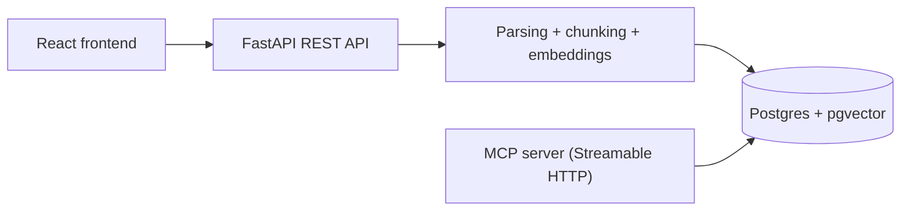

# Indigo Assignment

Backend-first implementation of an enterprise knowledge base with:

- React for the document management frontend
- FastAPI for document management and ingestion APIs
- PostgreSQL + pgvector for metadata and vector search
- A Python MCP server exposed over Streamable HTTP

The current milestone focuses on the MCP server and the shared backend services it depends on.

## Architecture Overview

The system is designed as a backend-first knowledge base with a shared retrieval layer exposed through both REST APIs and an MCP server.



## Why This Stack

- `FastAPI`: lightweight, typed, easy to share services between REST and MCP layers.
- `Postgres + pgvector`: one datastore for both relational metadata and semantic search.
- `Postgres full-text search`: lexical retrieval without introducing another search service.
- `OpenAI embeddings`: strong default quality, fast to integrate, easy to justify in a take-home assignment.

`Postgres + pgvector` is not necessarily the strongest possible choice for semantic retrieval in absolute terms compared with dedicated search engines or vector databases. I chose it because it offers the best overall tradeoff for this assignment: one operational system can handle structured document metadata, tag and document filters, vector similarity search, and lexical full-text search. This keeps the stack simpler to run locally, easier to reproduce with Docker, and easier to explain during review.

## Ingestion Design

### Parsing

- PDF: parsed with `pypdf`, page by page.
- Text: decoded as UTF-8 plain text.
- When possible, structured headings are extracted from short title-like lines and stored as `section_heading` on chunks.
- Chunk-level provenance is exposed in search results through:
  - `page_number` for PDF chunks
  - `section_heading` on a best-effort basis for structured documents

### Chunking Strategy

- Chunking is character-based with overlap.
- Default chunk size: `1200` chars.
- Default overlap: `200` chars.
- For PDFs, chunk provenance keeps the original `page_number`.

Why this choice:

- It is simple, deterministic, and easy to explain.
- It avoids very small fragments while preserving continuity across chunk boundaries.
- It is a good baseline for internal enterprise documents that are usually prose-heavy.

### Deduplication

- Every upload is hashed with SHA-256.
- `documents.checksum` is unique.
- Re-uploading the same file returns the existing document instead of duplicating chunks.

### Large Document Handling

- Embeddings are generated in batches instead of sending every chunk in a single request.
- This avoids request-size failures on large PDFs and makes ingestion more robust.
- Batch size is configurable through `EMBEDDING_BATCH_MAX_INPUTS` and `EMBEDDING_BATCH_MAX_TOKENS`.

### Retrieval Strategy

- Search uses a hybrid strategy:
  - dense retrieval with `pgvector`
  - lexical retrieval with PostgreSQL full-text search
- The two candidate sets are fused with Reciprocal Rank Fusion (RRF).
- This improves robustness on both semantic queries and exact-term queries such as acronyms, titles, and policy names.
- Very weak candidates and low-information chunks are filtered out to reduce garbage results on out-of-domain queries.
- The assignment bonus mentions BM25 specifically. In this implementation, the lexical side of hybrid retrieval uses PostgreSQL native full-text ranking rather than a dedicated BM25 engine.
- The reranking / rank-fusion step is implemented with Reciprocal Rank Fusion (RRF).
- With more time, a natural next step would be to replace or augment PostgreSQL lexical ranking with an explicit BM25 implementation while keeping the same hybrid retrieval flow.


---


### MCP Transport: Streamable HTTP

The MCP server is implemented over **Streamable HTTP using Server-Sent Events (SSE)**.

Why this choice:

- Allows **incremental delivery of results** instead of waiting for full responses
- Enables **low-latency agent interaction**, especially for retrieval-heavy queries
- Matches MCP expectations for streaming-capable transports
- Keeps implementation simple and compatible with standard HTTP infrastructure

Each MCP response is structured as a stream of events:

- `start` → request acknowledged
- `chunk` → partial result (one document chunk)
- `metadata` → aggregated info (e.g. total results)
- `end` → stream completed

This allows clients to process results progressively instead of blocking on full responses.

## MCP Tool Design

### Design Philosophy

The MCP tools are designed around **retrieval decision-making**, not data access.

Instead of exposing low-level primitives (e.g. "get chunk", "read document"), the tools guide the agent through a structured retrieval workflow:

1. Discover available scope (`list_tags`, `list_documents`)
2. Choose retrieval strategy (`search`, `search_by_tag`, `search_by_document`)
3. Retrieve grounded context for answer synthesis

This reduces tool selection ambiguity and improves agent reliability.


### MCP Tool Design Rationale

The tool set is intentionally small and decision-oriented rather than CRUD-heavy. The main goal is to help an
LLM choose the right search scope before retrieval starts.

Why these tools:

- `list_documents` helps the agent discover the available corpus and obtain exact filenames or IDs before narrowing to known sources.
- `list_tags` helps the agent discover the controlled vocabulary of business domains before using tag filters.
- `search` is the default exploratory tool when the correct scope is not known yet.
- `search_by_tag` exists because many enterprise questions are domain-specific, and tag filtering reduces noise significantly.
- `search_by_document` exists because employees often refer to known manuals, policies, or named guides directly.

Why these parameter choices:

- `query` is always explicit and required on search tools because the agent should always state the retrieval intent clearly.
- `limit` is optional with defaults to keep tool calls lightweight while still allowing the agent to ask for more context.
- `min_score` allows the agent to suppress weak matches when it wants to be conservative.
- `document_identifiers` accepts either exact filenames or document IDs to make the tool usable both after `list_documents` and in cases where the user already knows a filename.

Why no additional MCP tools right now:

- I intentionally did not add a document-read or chunk-read tool because the current search payload already returns enough grounded context for answer synthesis in this assignment.
- Keeping the tool surface compact reduces decision complexity for the LLM and makes the intended retrieval flow easier to learn:
  - discover scope with `list_tags` or `list_documents`
  - search broadly with `search` or narrowly with `search_by_tag` / `search_by_document`

### `list_documents`

When to use:

- To inspect what sources exist before narrowing a search
- When a user asks "what documents do we have?"

Returns:

- `id`
- `filename`
- `tags`
- `upload_date`
- `chunk_count`

### `list_tags`

When to use:

- To discover available topical filters before calling `search_by_tag`

Returns:

- all distinct tags currently assigned to at least one document

### `search`

When to use:

- For open-ended questions when the correct scope is not known yet

Inputs:

- `query: str`
- `limit: int = 5`
- `min_score: float = 0.0`

Returns:

- top hybrid-ranked matches with a short excerpt, full chunk text, source document, tags, score, and provenance

### `search_by_tag`

When to use:

- When the user already implies a business domain such as `compliance`, `hr`, `product`, or `onboarding`

Inputs:

- `query: str`
- `tags: list[str]`
- `limit: int = 5`
- `min_score: float = 0.0`

### `search_by_document`

When to use:

- When the user mentions one or more specific documents
- When an agent wants to stay grounded in a narrow set of known sources

Inputs:

- `query: str`
- `document_identifiers: list[str]`
- `limit: int = 5`
- `min_score: float = 0.0`

`document_identifiers` accepts either exact filenames or document IDs, which makes the tool easier for both humans and agents to use.

## API Surface

### Frontend

The React app provides the required management interface:

- upload PDF and TXT documents
- assign one or more tags during upload
- view the list of indexed documents with their tags and metadata
- delete a document from the knowledge base

### REST API

- `POST /api/documents`: upload a PDF or text file with comma-separated tags
- `GET /api/documents`: list uploaded documents
- `DELETE /api/documents/{document_id}`: delete a document
- `GET /api/tags`: list tags

All REST endpoints require authentication through:

- `Authorization: Bearer <MCP_AUTH_TOKEN>`

## MCP Server

- Endpoint: `/mcp`
- Transport: Streamable HTTP (SSE)
- Protocol: JSON-RPC over HTTP

### Authentication

Requests must include:

- `Authorization: Bearer <MCP_AUTH_TOKEN>`

### Tool Discovery
```GET /mcp/tools```

## Run Locally

1. Copy `.env.example` to `.env`
2. Add your OpenAI API key
3. Configure the environment variables (db, backend url etc.)
4. Start the stack:

```bash
docker compose up --build
```

This brings up:

- `db`: PostgreSQL 16 with `pgvector`
- `backend`: FastAPI app plus MCP server on the same container
- `frontend`: React app for document management

The frontend will be available at:

- `https://indigo-assignment-production.up.railway.app/`

The API will be available at:

- `https://marvelous-freedom-production-f0e5.up.railway.app/api`

The MCP endpoint will be available at:

- `https://marvelous-freedom-production-f0e5.up.railway.app/mcp`


## Railway Deployment Notes

The project is structured so it can be deployed to Railway as three services:

- `db`: PostgreSQL with `pgvector`
- `backend`: FastAPI REST API plus MCP server
- `frontend`: static React build served by a lightweight Node server

Deployment readiness notes:

- The backend listens on Railway's injected `PORT` variable.
- The frontend also listens on Railway's injected `PORT` variable.
- Frontend runtime configuration is injected at container startup through `API_BASE_URL` and `API_TOKEN`, so the backend URL does not need to be baked into the frontend build.
- For Railway, set `APP_ALLOWED_ORIGINS` on the backend to include the deployed frontend URL and, if needed, the backend public URL.
- The MCP endpoint should be exposed from the backend service over Railway HTTPS at `/mcp/`.

Recommended Railway environment variables:

Backend:

- `DATABASE_URL`
- `OPENAI_API_KEY`
- `MCP_AUTH_TOKEN`
- `APP_ALLOWED_ORIGINS`

Frontend:

- `API_BASE_URL`
- `API_TOKEN`

## Connect an MCP Client

One example with an MCP-compatible client:

- server URL: `https://marvelous-freedom-production-f0e5.up.railway.app/mcp/`
- auth header: `Authorization: Bearer <MCP_AUTH_TOKEN>`


---

## Known Limitations

- No background job queue: ingestion runs synchronously
- Chunking is purely character-based (not structure-aware)
- No reranking model beyond RRF
- No caching layer for frequent queries
- Streaming is unidirectional (SSE), not full duplex
- MCP implementation is custom (not using full SDK transport stack)

## What I Would Improve With More Time

- Replace PostgreSQL lexical ranking with explicit BM25
- Add cross-encoder reranking for higher precision
- Implement async ingestion with a job queue
- Improve chunking with heading-aware or semantic splitting
- Support additional formats (DOCX, HTML)
- Add observability (tracing, latency breakdown per retrieval stage)
- Implement bidirectional streaming (WebSockets) for richer agent interaction
