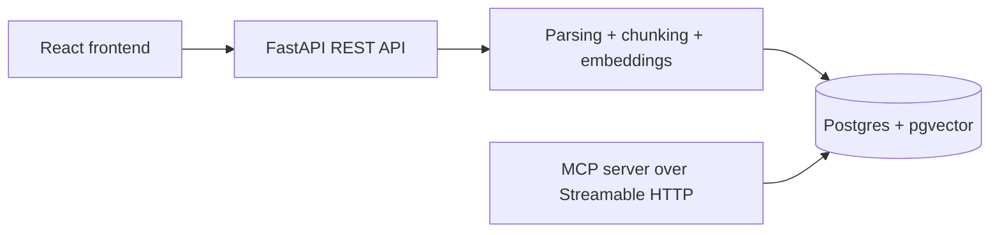

# Indigo Assignment

Backend-first implementation of an enterprise knowledge base with:

- React for the document management frontend
- FastAPI for document management and ingestion APIs
- PostgreSQL + pgvector for metadata and vector search
- A Python MCP server exposed over Streamable HTTP

The current milestone focuses on the MCP server and the shared backend services it depends on.

## Architecture Overview



## Why This Stack

- `FastAPI`: lightweight, typed, easy to share services between REST and MCP layers.
- `Postgres + pgvector`: one datastore for both relational metadata and semantic search.
- `OpenAI embeddings`: strong default quality, fast to integrate, easy to justify in a take-home assignment.
- `FastMCP` from the official Python MCP SDK: gives us a standards-aligned MCP server with Streamable HTTP support.

## Ingestion Design

### Parsing

- PDF: parsed with `pypdf`, page by page.
- Text: decoded as UTF-8 plain text.
- When possible, structured headings are extracted from short title-like lines and stored as `section_heading` on chunks.

### Chunking Strategy

- Chunking is character-based with overlap.
- Default chunk size: `1200` chars.
- Default overlap: `200` chars.
- For PDFs, chunk provenance keeps the original `page_number`.

Why this choice:

- It is simple, deterministic, and easy to explain.
- It avoids very small fragments while preserving continuity across chunk boundaries.
- It is a good baseline for internal enterprise documents that are usually prose-heavy.

### Deduplication

- Every upload is hashed with SHA-256.
- `documents.checksum` is unique.
- Re-uploading the same file returns the existing document instead of duplicating chunks.

### Large Document Handling

- Embeddings are generated in batches instead of sending every chunk in a single request.
- This avoids request-size failures on large PDFs and makes ingestion more robust.
- Batch size is configurable through `EMBEDDING_BATCH_MAX_INPUTS` and `EMBEDDING_BATCH_MAX_TOKENS`.

## MCP Tool Design

The server exposes five agent-ready tools:

### `list_documents`

When to use:

- To inspect what sources exist before narrowing a search
- When a user asks "what documents do we have?"

Returns:

- `id`
- `filename`
- `tags`
- `upload_date`
- `chunk_count`

### `list_tags`

When to use:

- To discover available topical filters before calling `search_by_tag`

Returns:

- all distinct tags currently assigned to at least one document

### `search`

When to use:

- For open-ended questions when the correct scope is not known yet

Inputs:

- `query: str`
- `limit: int = 5`
- `min_score: float = 0.0`

Returns:

- top semantic matches with a short excerpt, full chunk text, source document, tags, score, and provenance

### `search_by_tag`

When to use:

- When the user already implies a business domain such as `compliance`, `hr`, `product`, or `onboarding`

Inputs:

- `query: str`
- `tags: list[str]`
- `limit: int = 5`
- `min_score: float = 0.0`

### `search_by_document`

When to use:

- When the user mentions one or more specific documents
- When an agent wants to stay grounded in a narrow set of known sources

Inputs:

- `query: str`
- `document_identifiers: list[str]`
- `limit: int = 5`
- `min_score: float = 0.0`

`document_identifiers` accepts either exact filenames or document IDs, which makes the tool easier for both humans and agents to use.

## API Surface

### Frontend

The React app provides the required management interface:

- upload PDF and TXT documents
- assign one or more tags during upload
- view the list of indexed documents with their tags and metadata
- delete a document from the knowledge base

### REST API

- `POST /api/documents`: upload a PDF or text file with comma-separated tags
- `GET /api/documents`: list uploaded documents
- `DELETE /api/documents/{document_id}`: delete a document
- `GET /api/tags`: list tags
- `GET /api/search`: backend search endpoint used for debugging and future frontend integration

All REST endpoints require authentication through either:

- `Authorization: Bearer <MCP_AUTH_TOKEN>`
- `X-API-Key: <MCP_AUTH_TOKEN>`

### MCP Server

- Endpoint: `http://localhost:8000/mcp/`
- Transport: Streamable HTTP
- Authentication:
  - `Authorization: Bearer <MCP_AUTH_TOKEN>`
  - or `X-API-Key: <MCP_AUTH_TOKEN>`

The server also validates the `Origin` header for MCP requests to reduce DNS rebinding risk.

## Run Locally

1. Copy `.env.example` to `.env`
2. Add your OpenAI API key
3. Start the stack:

```bash
docker compose up --build
```

This brings up:

- `db`: PostgreSQL 16 with `pgvector`
- `backend`: FastAPI app plus MCP server on the same container
- `frontend`: React app for document management

The frontend will be available at:

- `http://localhost:3000`

The API will be available at:

- `http://localhost:8000/api`

The MCP endpoint will be available at:

- `http://localhost:8000/mcp`

## Requirements Files

The repository includes both packaging styles:

- [requirements.txt](/Users/adrianostrinati/Documents/Lavoro/repository/indigo-assignment/requirements.txt): runtime dependencies
- [requirements-dev.txt](/Users/adrianostrinati/Documents/Lavoro/repository/indigo-assignment/requirements-dev.txt): runtime + test/lint dependencies
- [pyproject.toml](/Users/adrianostrinati/Documents/Lavoro/repository/indigo-assignment/pyproject.toml): project metadata and tool configuration

Frontend dependencies live in:

- [frontend/package.json](/Users/adrianostrinati/Documents/Lavoro/repository/indigo-assignment/frontend/package.json)

Local install examples:

```bash
python -m venv .venv
source .venv/bin/activate
pip install -r requirements-dev.txt
```

## Connect an MCP Client

One example with an MCP-compatible client:

- server URL: `http://localhost:8000/mcp/`
- auth header: `Authorization: Bearer <MCP_AUTH_TOKEN>`

For local inspection you can also use the official MCP Inspector against the same endpoint.

For local smoke tests without an external client, you can use [test_mcp.py](/Users/adrianostrinati/Documents/Lavoro/repository/indigo-assignment/test_mcp.py):

```bash
python test_mcp.py smoke --query "remote setup"
python test_mcp.py call --tool list_documents
python test_mcp.py call --tool search_by_tag --args '{"query":"remote setup","tags":["onboarding"],"limit":3}'
```

## Known Limitations

- Search is dense-vector only for now; hybrid retrieval would be a strong next improvement.
- No background job queue yet; ingestion runs inline with the upload request.
- Plain text and PDF are supported, but DOCX/HTML exporters could be added later.

## Next Steps

- Add hybrid search with BM25 + vector fusion
- Improve chunking with heading-aware splitting
- Add automated integration tests against a disposable Postgres instance
